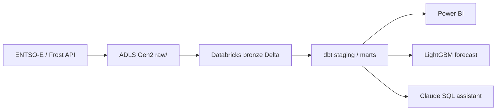

# kraftdata

An end-to-end data platform for Norwegian electricity prices, built as a portfolio project.

Day-ahead spot prices for the five Norwegian bidding zones (NO1–NO5) and temperatures for
five cities are ingested into Azure Data Lake Storage Gen2, loaded into Databricks as Delta
tables, modelled with dbt, and used for a next-day price forecast and a natural-language
SQL assistant.

> Work in progress. The README is completed in the final phase.

## Planned architecture



## Repository layout

| Folder    | Contents                                         |
|-----------|--------------------------------------------------|
| `ingest/` | Python ingestion from ENTSO-E and Frost to ADLS  |
| `dbt/`    | dbt project (staging, intermediate, marts)       |
| `ml/`     | Forecasting model and MLflow tracking            |
| `agent/`  | Natural-language to SQL assistant using Claude   |
| `infra/`  | Azure CLI scripts for the cloud resources        |
| `docs/`   | Diagrams and documentation                       |
| `tests/`  | pytest unit tests                                |

## Getting started

```bash
uv sync                 # create .venv and install dependencies
cp .env.example .env    # then fill in your own keys; .env is git-ignored
```

Azure resources are created with two Azure CLI scripts (run `az login` first):

```bash
STORAGE_ACCOUNT=<name> ./infra/setup.sh             # ADLS Gen2 account + raw container
STORAGE_ACCOUNT=<name> ./infra/setup_databricks.sh  # Databricks workspace + Unity Catalog access
```

The Databricks CLI uses the profile `kraftdata` with `auth_type = azure-cli`, so it reuses
the Azure login and no personal access token is stored locally. Test the connection with:

```bash
databricks current-user me --profile kraftdata
```

To delete everything: `az group delete --name rg-kraftdata --yes`.
