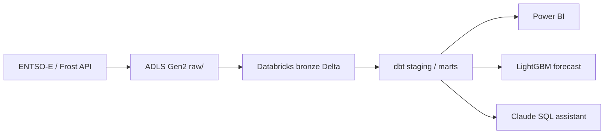
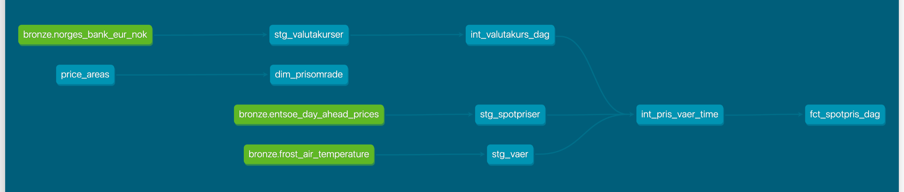

# kraftdata

An end-to-end data platform for Norwegian electricity prices, built as a portfolio project.

Day-ahead spot prices for the five Norwegian bidding zones (NO1–NO5) and temperatures for
five cities are ingested into Azure Data Lake Storage Gen2, loaded into Databricks as Delta
tables, modelled with dbt, and used for a next-day price forecast and a natural-language
SQL assistant.

> Work in progress. The README is completed in the final phase.

## Planned architecture



## Repository layout

| Folder    | Contents                                         |
|-----------|--------------------------------------------------|
| `ingest/` | Python ingestion from ENTSO-E and Frost to ADLS  |
| `dbt/`    | dbt project (staging, intermediate, marts)       |
| `ml/`     | Forecasting model and MLflow tracking            |
| `agent/`  | Natural-language to SQL assistant using Claude   |
| `jobs/`   | Entry points for Databricks jobs                 |
| `dashboards/` | Databricks AI/BI dashboard definition        |
| `infra/`  | Azure CLI scripts for the cloud resources        |
| `docs/`   | Diagrams and documentation                       |
| `tests/`  | pytest unit tests                                |

## Getting started

```bash
uv sync                 # create .venv and install dependencies
cp .env.example .env    # then fill in your own keys; .env is git-ignored
```

Azure resources are created with two Azure CLI scripts (run `az login` first):

```bash
STORAGE_ACCOUNT=<name> ./infra/setup.sh             # ADLS Gen2 account + raw container
STORAGE_ACCOUNT=<name> ./infra/setup_databricks.sh  # Databricks workspace + Unity Catalog access
```

The Databricks CLI uses the profile `kraftdata` with `auth_type = azure-cli`, so it reuses
the Azure login and no personal access token is stored locally. Test the connection with:

```bash
databricks current-user me --profile kraftdata
```

To delete everything: `az group delete --name rg-kraftdata --yes`.

## Ingestion (EL)

Day-ahead prices for NO1-NO5 come from the ENTSO-E Transparency Platform
([`ingest/entsoe.py`](ingest/entsoe.py)). The parser handles:

- **Two resolutions:** prices are published as `PT60M` until February 2025 and as `PT15M`
  after that. Until the Nordic day-ahead market moved to 15-minute products (delivery day
  1 October 2025) the four quarter-hours of an hour simply repeat the hourly price.
- **Curve type A03:** a point is omitted when the price equals the previous one, so gaps
  are forward-filled.
- **Repeated series:** the API can return the same period twice; rows are de-duplicated.
- **Norwegian market days:** a delivery date is a calendar day in `Europe/Oslo`, which is
  23 or 25 hours long when daylight saving time starts or ends.

Raw data lands in ADLS as one JSON Lines file per delivery date:

```
raw/entsoe/day_ahead_prices/date=2026-10-06/prices.jsonl
```

The path is deterministic and every write overwrites the whole file, so re-running a date
replaces it instead of creating duplicates.

```bash
uv run python -m ingest.prices --start 2022-01-01 --end 2026-10-08  # backfill
uv run python -m ingest.prices                                      # last few days
uv run pytest
```

Hourly air temperature comes from MET Norway's Frost API
([`ingest/frost.py`](ingest/frost.py)), using one station per bidding zone:

| Zone | City         | Station                    |
|------|--------------|----------------------------|
| NO1  | Oslo         | SN18700 Oslo - Blindern    |
| NO2  | Kristiansand | SN39040 Kjevik             |
| NO3  | Trondheim    | SN68860 Trondheim - Voll   |
| NO4  | Tromsø       | SN90450 Tromsø             |
| NO5  | Bergen       | SN50540 Bergen - Florida   |

The values are the 2 m temperature at the full hour, partitioned by Norwegian calendar day
in `raw/frost/air_temperature/date=YYYY-MM-DD/observations.jsonl`.

```bash
uv run python -m ingest.temperatures --start 2022-01-01 --end 2026-10-07
```

### Bronze and the daily job

Unity Catalog exposes the raw container as the external volume
`dbw_kraftdata.landing.raw`. The SQL files in [`ingest/sql/`](ingest/sql/) load it into the
Delta tables `dbw_kraftdata.bronze.entsoe_day_ahead_prices` and
`dbw_kraftdata.bronze.frost_air_temperature` with `INSERT ... REPLACE WHERE`, which swaps
out exactly the loaded dates.

The daily job is defined as a Databricks Asset Bundle in [`databricks.yml`](databricks.yml)
and runs on serverless compute at 14:30 Oslo time, after next-day prices are published.
After the three ingestion tasks (prices, temperatures, EUR/NOK rates) a dbt task rebuilds
the production schemas.
It has one task per source, so a failing API does not block the other. The API keys are
read from the Databricks secret scope `kraftdata`.

```bash
databricks bundle deploy
databricks bundle run daily_ingest
```

## Transformation with dbt

The dbt project in [`dbt/`](dbt/) turns the bronze tables into a tested data model:



| Layer        | Models                                             | Materialized |
|--------------|----------------------------------------------------|--------------|
| staging      | `stg_spotpriser`, `stg_vaer`, `stg_valutakurser`   | view         |
| intermediate | `int_valutakurs_dag`, `int_pris_vaer_time`         | view / table |
| marts        | `fct_spotpris_dag`, `dim_prisomrade`               | table        |

Design choices:

- **Hourly grain in `int_pris_vaer_time`.** Since October 2025 each hour has four
  15-minute prices. They are averaged to hours so they line up with hourly temperatures.
- **Norwegian market days.** `fct_spotpris_dag` groups by `delivery_date`, the day in
  `Europe/Oslo`. Timestamps are stored in UTC and converted once, in staging
  (`*_local` columns). This matters because a Norwegian day starts at 22:00 or 23:00 UTC
  and has 23 or 25 hours when daylight saving time starts or ends; grouping by UTC date
  would mix two market days. `hours_in_day` is tested to be 23, 24 or 25.
- **øre/kWh.** Prices are converted with Norges Bank's EUR/NOK rate. Days without a rate
  (weekends, holidays) use the latest earlier rate. Prices exclude VAT, grid tariffs and fees.

Tests include `not_null`, `unique` (also on column combinations), `accepted_values` for
bidding zones, `relationships` to `dim_prisomrade`, and a custom generic test
[`price_in_reasonable_range`](dbt/tests/generic/price_in_reasonable_range.sql) that checks
prices against the day-ahead market's harmonised limits (-500 to 4000 EUR/MWh).

Environments are separated by schema: local development builds into `dbt_dev_*`, CI into
`dbt_ci_*`, and the daily Databricks job builds `staging`, `intermediate` and `marts`
(see [`generate_schema_name`](dbt/macros/generate_schema_name.sql)).

```bash
cd dbt
uv run --env-file ../.env dbt deps
uv run --env-file ../.env dbt build          # dev schemas
uv run --env-file ../.env dbt docs generate && uv run --env-file ../.env dbt docs serve
```

### CI

[GitHub Actions](.github/workflows/ci.yml) runs ruff, pytest and `dbt build --target ci` on
every push and pull request. dbt authenticates as the service principal `kraftdata-ci`
with OAuth machine-to-machine credentials (client secret stored as a GitHub secret). It can
only read `bronze` and create its own schemas, and it cannot touch the production marts.

## Dashboard

An AI/BI dashboard in Databricks shows daily and 15-minute prices per zone, monthly
averages, the latest day, and price against temperature. It is defined as code in
[`dashboards/kraftdata.lvdash.json`](dashboards/kraftdata.lvdash.json) (SQL datasets plus
widget layout) and deployed with the bundle.

Two ways to change it:

1. Edit the SQL or layout in the JSON file and run `databricks bundle deploy`.
2. Edit it in the Databricks UI, then pull the changes back into the repo with
   `databricks bundle generate dashboard --resource kraftdata --force` and commit.

The dashboard reads the dbt marts (prices in øre/kWh) and the 15-minute prices from staging.

## Data sources and licenses

- Day-ahead prices: [ENTSO-E Transparency Platform](https://transparency.entsoe.eu/).
- Exchange rates: [Norges Bank](https://www.norges-bank.no/en/topics/Statistics/exchange_rates/).
- Temperatures: [MET Norway, Frost API](https://frost.met.no/), licensed under
  [CC BY 3.0 NO](https://creativecommons.org/licenses/by/3.0/no/).
